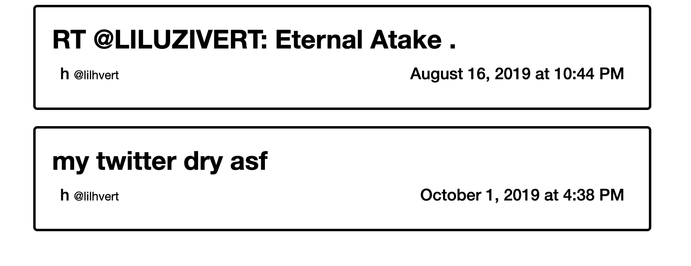

# TwitterNovel (WIP)

Uses Python 3

## Make a novel out of your tweets.
### Currently outputs a big html file with your tweets formatted nicely.
(Twitter limit might be 200 tweets, or may be a bug in my script)

## Configure Twitter API keys and user handle in **main.py**.

## Personalize CSS in **assets/main.css** (if you want)

Install python-twitter using pip
> pip3 install python-twitter

After configuring main.py...
> python3 main.py

## Screenshot

